<div align="center">

# 🌟 Tajawaz Solutions


<p>
  <a href="https://www.tajawaz.my.id">
    
  </a>
  
  
  
</p>


</div>

---

## 👨‍💻 About Tajawaz Solutions


```typescript
const tajawazSolutions = {
    founder: "Your Name",
    brand: "Tajawaz Solutions",
    website: "www.tajawaz.my.id",
    location: "Parung, West Java, Indonesia",
    
    passion: [
        "Vibe Coding 🎨",
        "Clean Architecture 🏗️",
        "Innovation & Creativity 💡",
        "Open Source 🌍"
    ],
    
    mission: "Transforming ideas into elegant digital solutions",
    vision: "Building the future, one commit at a time",
    
    currentFocus: [
        "Full Stack Development",
        "UI/UX Design",
        "Web3 & Blockchain",
        "AI Integration"
    ],
    
    workingOn: "🚀 Next-gen web applications",
    learning: "📚 Advanced System Design",
    collaborate: "💼 Open for freelance projects",
    
    philosophy: "Code with purpose, design with soul 💜"
};
```

<br clear="right"/>

---

## 🛠️ Tech Arsenal

<div align="center">

### 💎 Core Technologies

#### Frontend Mastery


#### Backend Power


#### Database & Storage


#### DevOps & Tools


#### Design & Productivity


</div>

---

## 📊 GitHub Analytics

<div align="center">
  
  
</div>

<div align="center">
  
</div>

<div align="center">
  
</div>

<div align="center">
  
### 🏆 GitHub Trophies
  


</div>

---

## 🚀 Featured Projects

<div align="center">

### 💜 Vibe Coding Portfolio

</div>

<table>
<tr>
<td width="50%">

### 🌟 Project Alpha
**Modern E-Commerce Platform**


**Features:**
- 🛒 Full Shopping Cart System
- 💳 Payment Gateway Integration
- 📱 Responsive Design
- ⚡ Lightning Fast Performance

**Status:** 🚀 Live in Production

[View Project →](https://github.com/YOUR_GITHUB_USERNAME/REPO_NAME_1)

</td>
<td width="50%">

### 🎨 Project Beta
**AI-Powered Design Tool**


**Features:**
- 🤖 AI Content Generation
- 🎨 Real-time Collaboration
- 🔒 Enterprise Security
- 📊 Analytics Dashboard

**Status:** 🚧 In Development

[View Project →](https://github.com/YOUR_GITHUB_USERNAME/REPO_NAME_2)

</td>
</tr>

<tr>
<td width="50%">

### 🌐 Project Gamma
**Social Media Dashboard**


**Features:**
- 📈 Multi-platform Integration
- 📊 Advanced Analytics
- 🔔 Real-time Notifications
- 🎯 Content Scheduling

**Status:** 💡 Planning Phase

[View Project →](https://github.com/YOUR_GITHUB_USERNAME/REPO_NAME_3)

</td>
<td width="50%">

### 🔐 Project Delta
**Blockchain Wallet**


**Features:**
- 💰 Multi-currency Support
- 🔒 Military-grade Encryption
- 📱 Mobile-first Design
- ⛓️ Smart Contract Integration

**Status:** ✨ Concept Stage

[View Project →](https://github.com/YOUR_GITHUB_USERNAME/REPO_NAME_4)

</td>
</tr>
</table>

<div align="center">

[](https://github.com/YOUR_GITHUB_USERNAME?tab=repositories)

</div>

---

## 📝 Latest Blog Posts & Articles

<div align="center">

### ✍️ Sharing Knowledge & Insights

</div>

<!-- BLOG-POST-LIST:START -->
- 🚀 [Building Scalable Web Applications with Next.js 14](https://www.tajawaz.my.id/blog/nextjs-14-guide)
- 💡 [10 TypeScript Tips for Better Code Quality](https://www.tajawaz.my.id/blog/typescript-tips)
- 🎨 [The Art of Vibe Coding: Creating Beautiful UIs](https://www.tajawaz.my.id/blog/vibe-coding)
- 🔒 [Web Security Best Practices in 2024](https://www.tajawaz.my.id/blog/web-security)
- ⚡ [Optimizing React Performance: A Deep Dive](https://www.tajawaz.my.id/blog/react-optimization)
<!-- BLOG-POST-LIST:END -->

<a href="https://www.tajawaz.my.id/blog">
  
</a>

---

## 🎯 Current Focus & Goals

```mermaid
graph LR
    A[🎯 2024 Goals] --> B[📚 Learning]
    A --> C[🚀 Projects]
    A --> D[🌍 Community]
    
    B --> B1[Advanced System Design]
    B --> B2[Cloud Architecture]
    B --> B3[AI & Machine Learning]
    
    C --> C1[5 Major Projects]
    C --> C2[10 Open Source Contributions]
    C --> C3[Launch SaaS Product]
    
    D --> D1[Mentoring Developers]
    D --> D2[Technical Writing]
    D --> D3[Conference Speaking]
    
    style A fill:#5F2DED,stroke:#fff,stroke-width:2px,color:#fff
    style B fill:#FF6B6B,stroke:#fff,stroke-width:2px,color:#fff
    style C fill:#4ECDC4,stroke:#fff,stroke-width:2px,color:#fff
    style D fill:#95E1D3,stroke:#fff,stroke-width:2px,color:#fff
```

<div align="center">



</div>

### 🎓 Currently Learning
- 🧠 Advanced AI & Machine Learning
- ☁️ AWS Solutions Architecture
- 🔗 Web3 & Blockchain Development
- 📊 Data Structures & Algorithms (Advanced)

### 🎯 2024 Roadmap
- ✅ Launch 5 major projects
- ✅ Contribute to 10+ open source projects
- ✅ Reach 1000+ GitHub followers
- ✅ Write 20 technical articles
- ✅ Mentor 50+ junior developers

---

## 💼 Services & Expertise

<div align="center">

<table>
<tr>
<td align="center" width="25%">


### 🖥️ Web Development
Full-stack development with modern frameworks and best practices
</td>
<td align="center" width="25%">


### 📱 Mobile Apps
Cross-platform mobile applications that deliver exceptional UX
</td>
<td align="center" width="25%">


### 🎨 UI/UX Design
Beautiful, intuitive interfaces that users love
</td>
<td align="center" width="25%">


### 🔌 API Development
Robust, scalable APIs and microservices
</td>
</tr>
</table>

</div>

---

## 🎨 Coding Philosophy & Principles

<div align="center">

> *"Code is poetry written in logic. Every project is a canvas, every function is a brushstroke, and every commit is a step toward masterpiece."*  
> **— Tajawaz Solutions**

</div>

```javascript
const codingPrinciples = {
    clean: "Write code that humans can understand",
    simple: "Simplicity is the ultimate sophistication",
    tested: "Untested code is broken code",
    documented: "Code tells you how, comments tell you why",
    refactored: "Make it work, make it right, make it fast",
    collaborative: "Code is written once, read many times",
    passionate: "Love what you code, code what you love"
};

// My Daily Workflow
const dailyRoutine = async () => {
    await drinkCoffee();
    await writeCleanCode();
    await solveProblems();
    await learnSomethingNew();
    await helpCommunity();
    return "Another productive day! 🚀";
};
```

<div align="center">

### 🌈 Development Vibe Check

| Category | Vibe Level |
|----------|-----------|
| 🎨 **Design** | ████████████████████ 100% |
| 💻 **Frontend** | ███████████████████░ 95% |
| ⚙️ **Backend** | ██████████████████░░ 90% |
| 📱 **Mobile** | ████████████████░░░░ 85% |
| 🔒 **Security** | ██████████████████░░ 92% |
| 🚀 **DevOps** | █████████████████░░░ 88% |

</div>

---

## 🤝 Open Source Contributions

<div align="center">

### 🌟 Giving Back to the Community


</div>

```yaml
Contribution Stats:
  Pull Requests: 50+
  Issues Resolved: 75+
  Projects Contributed: 30+
  Stars Received: 500+
  
Focus Areas:
  - Web Development Tools
  - UI Component Libraries
  - Developer Productivity
  - Documentation Improvements
```

<div align="center">


</div>

---

## 📫 Let's Connect & Collaborate

<div align="center">

### 💜 Get in Touch

<p>
  <a href="https://www.tajawaz.my.id">
    
  </a>
  <a href="mailto:contact@tajawaz.my.id">
    
  </a>
</p>

<p>
  <a href="https://linkedin.com/in/YOUR_LINKEDIN">
    
  </a>
  <a href="https://twitter.com/YOUR_TWITTER">
    
  </a>
  <a href="https://instagram.com/YOUR_INSTAGRAM">
    
  </a>
</p>

<p>
  <a href="https://discord.gg/YOUR_DISCORD">
    
  </a>
  <a href="https://t.me/YOUR_TELEGRAM">
    
  </a>
  <a href="https://wa.me/YOUR_WHATSAPP">
    
  </a>
</p>

### 💼 Available for:
🎯 Freelance Projects • 🤝 Collaborations • 💡 Consulting • 🎓 Mentoring


</div>

---

## 💖 Support My Work

<div align="center">

### 🌟 If you like my work, consider:

<p>
  <a href="https://github.com/YOUR_GITHUB_USERNAME">
    
  </a>
  <a href="https://github.com/YOUR_GITHUB_USERNAME?tab=followers">
    
  </a>
</p>

<p>
  <a href="https://ko-fi.com/YOUR_USERNAME">
    
  </a>
  <a href="https://trakteer.id/YOUR_USERNAME">
    
  </a>
</p>

### 🎵 Coding with Vibes


</div>

---

<div align="center">

### 📊 Weekly Development Breakdown

<!--START_SECTION:waka-->
```text
TypeScript   12 hrs 30 mins  ████████████░░░░░░░░░   50.2%
JavaScript   5 hrs 15 mins   █████░░░░░░░░░░░░░░░░   21.1%
Python       3 hrs 45 mins   ███░░░░░░░░░░░░░░░░░░   15.1%
CSS          2 hrs 10 mins   ██░░░░░░░░░░░░░░░░░░░    8.7%
JSON         1 hr 15 mins    █░░░░░░░░░░░░░░░░░░░░    5.0%
```
<!--END_SECTION:waka-->

---

### 💭 Random Dev Quote


---

### 😂 Developer Humor


---


### 💫 *"Building the future, one commit at a time"*

<p>
  
</p>

**© 2024 Tajawaz Solutions** • Made with 💜 and ☕ in Indonesia

*Let's create something amazing together!* ✨

</div>
